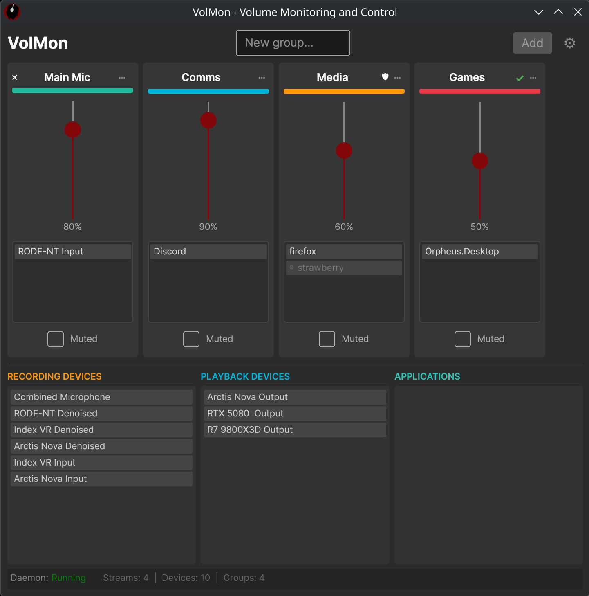
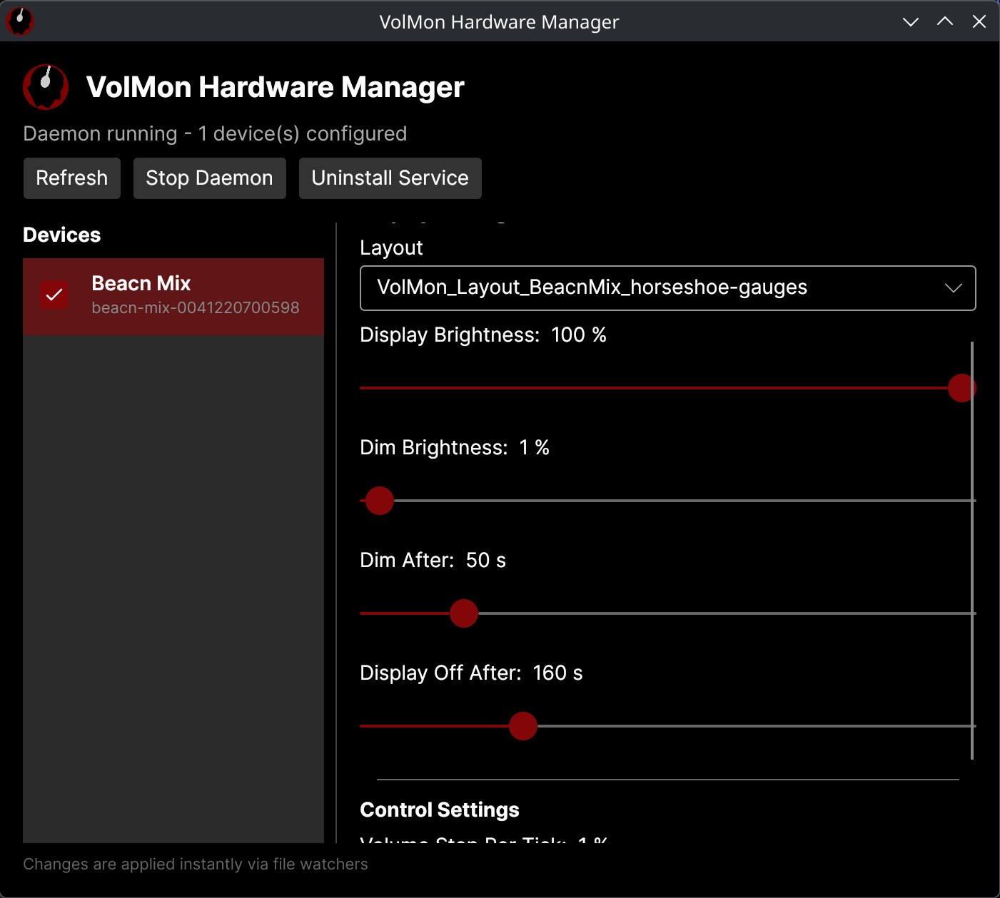
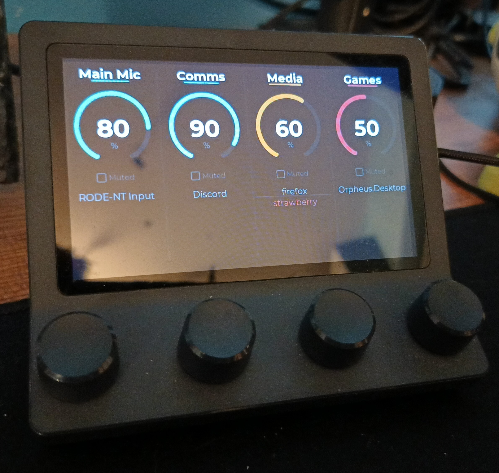

<p align="center">
  
</p>

# VolMon

A cross-platform utility for grouping applications by audio stream and
controlling their volumes as a group. Works with PulseAudio/PipeWire on Linux,
Core Audio (WASAPI) on Windows, and CoreAudio HAL on macOS.

## Features

- **Group applications** by process name or audio class (supports glob patterns)
- **Set group volumes** — all apps in a group share the same volume
- **Auto-apply** — new audio streams are automatically matched and configured
- **GUI** — manage groups from the GUI, minimizes to tray
- **Daemon** — background service ensures volumes are applied even without the GUI open
- **Hardware control** — physical USB controllers (dials, buttons, displays) for hands-on volume management
- **Hardware GUI** — configure and manage hardware devices, install the hardware daemon as a service
- **KDE/GNOME/Windows/macOS** — GUI uses Avalonia UI for cross-platform tray support

### Supported Hardware

| Device | Dials | Buttons | Display | Status |
|---|---|---|---|---|
| [Beacn Mix](https://www.beacn.com/pages/beacn-mix) | 4 rotary encoders | 4 dial buttons | 800x480 LCD | Fully supported |
| Beacn Mix Create | 4 rotary encoders | 4 dial buttons | 800x480 LCD | Detected, untested |

## Screenshots

| Desktop GUI | Hardware Manager | Beacn Mix |
|---|---|---|
|  |  |  |

## Architecture

See [ARCHITECTURE.md](./ARCHITECTURE.md)

## Install

Download the release for your platform from the [Releases](../../releases) page.
Binaries are self-contained — no .NET runtime required.

### Linux

Prerequisites: PulseAudio or PipeWire, and `libusb-1.0` if you use hardware devices.

Extract the zip and run the installer:

```bash
unzip VolMon-linux-x64.zip
cd linux-x64
./install-linux.sh
```

`install-linux.sh` copies binaries to `~/.local/lib/volmon/`, writes launcher
scripts to `~/.local/bin/`, registers the daemon as a systemd user service, adds
the GUI to autostart, and installs desktop entries and the icon. The daemon starts
immediately.

To also install the hardware daemon and hardware GUI:

```bash
./install-linux.sh --include-hardware
```

To uninstall everything (stops services, removes all files):

```bash
./install-linux.sh --uninstall
```

### Windows

**With the installer:** run `VolMon-win-x64.msi`. The installer lets you choose
whether to include hardware support during setup. Files are installed to
`%ProgramFiles%\VolMon\` and services are registered automatically. Uninstalling
via Add/Remove Programs cleans everything up.

**Without the installer:** extract the zip to a permanent location (e.g.
`C:\Program Files\VolMon\`) and run from that folder in PowerShell:

```powershell
.\register.ps1                   # core daemon + GUI
.\register.ps1 -IncludeHardware  # also register hardware daemon + hardware GUI
.\register.ps1 -Unregister       # remove all tasks and shortcuts
```

### macOS

> **Untested.** The macOS build is compiled and packaged in CI but has not been
> run on a real Mac. Proceed with caution and please report any issues.

**With the installer:** run `VolMon-osx-x64.pkg`. The installer will ask whether
to include hardware support. Files are installed to `/usr/local/lib/volmon/`, a
`VolMon.app` bundle is created in `~/Applications/`, and launchd user agents are
registered for the daemon and GUI.

**Without the installer:** extract the zip to a permanent location, then:

```bash
sudo mkdir -p /usr/local/lib/volmon
sudo cp -R VolMon-osx-x64/. /usr/local/lib/volmon/
chmod +x /usr/local/lib/volmon/register.sh
/usr/local/lib/volmon/register.sh
```

```bash
./register.sh                    # core daemon + GUI
./register.sh --include-hardware # also register hardware daemon + hardware GUI
./register.sh --unregister       # unload agents and remove .app bundles
```

---

For building from source, see [DEVELOPMENT.md](./DEVELOPMENT.md).

## Running

After installation the daemon and GUI start automatically on login. To start them
manually:

### Linux

```bash
systemctl --user start volmon       # start the daemon
volmon-gui                          # start the GUI
volmon-hardware-gui                 # start the hardware configuration GUI (if installed)
```

### Windows

The daemon runs as a Task Scheduler task. To start it manually, open Task Scheduler
and run the **VolMon Daemon** task, or launch `VolMon.Daemon.exe` directly from
`%ProgramFiles%\VolMon\`. The GUI can be launched from the Start Menu shortcut or
by running `VolMon.GUI.exe`.

### macOS

> **Untested.** See the macOS note in the Install section.

```bash
launchctl start com.volmon.daemon   # start the daemon
open -a VolMon                      # start the GUI
```

## Hardware

**Disclaimer:** VolMon's hardware daemon doesn't require or install new firmware,
it's out of scope for this project to include that, if the hardware cannot be
supported out of the box, a different project might provide a more open firmware.
However, regardless if your hardware is supported or not, we cannot provide any
support or guarantees, especially if you use other software that interfaces with
your hardware such as it's official software for a given operating system.

_**Please use resopnsibly and AT YOUR OWN RISK!**_

The hardware daemon (`VolMon.Hardware`) connects to USB controllers and bridges
them to the VolMon daemon via IPC. Each physical dial maps to a volume group,
dial rotation changes volume, and dial button press toggles mute. Devices with
displays show group names, volumes, and mute states.

See [src/VolMon.Hardware/README.md](./src/VolMon.Hardware/README.md) for
architecture details, and
[src/VolMon.Hardware/Beacn/Mix/README.md](./src/VolMon.Hardware/Beacn/Mix/README.md)
for the Beacn Mix USB protocol documentation.

### Hardware Config

Hardware configuration lives alongside the main config in the same platform folder:

| File | Purpose |
|---|---|
| `hardware.json` | Master config — lists all known devices, enabled/disabled state |
| `beacn-mix-{serial}.json` | Per-device config — display brightness, layout, volume step, timeouts |

New devices are detected automatically and added to `hardware.json` as
**disabled** by default. Use the Hardware GUI or edit the file directly to
enable them.

## Config

Config files are stored in a platform-specific folder:

| Platform | Config folder |
|---|---|
| Linux | `~/.config/volmon/` |
| Windows | `%APPDATA%\volmon\` |
| macOS | `~/Library/Application Support/volmon/` |

The main config file is `config.json` inside that folder. Example:

```json
{
  "groups": [
    {
      "name": "Default",
      "volume": 100,
      "muted": false,
      "isDefault": true,
      "programs": [],
      "devices": []
    },
    {
      "name": "Music",
      "volume": 80,
      "muted": false,
      "isDefault": false,
      "programs": ["spotify", "rhythmbox"],
      "devices": []
    },
    {
      "name": "Comms",
      "volume": 90,
      "muted": false,
      "isDefault": false,
      "programs": ["discord", "telegram-desktop"],
      "devices": ["alsa_input.pci-0000_00_1f.3.analog-stereo"]
    }
  ]
}
```

### Group fields

- **programs** — list of process binary names. Matching is case-insensitive.
- **devices** — list of audio device backend names. These are shown in the GUI's device pool.
- **isDefault** — one group should be default. Unrecognized programs go here automatically.
- New hardware devices are **never** auto-assigned. Add them explicitly.

## Platform Support

| Platform | Streams (per-app) | Devices | Monitoring |
|---|---|---|---|
| Linux (PulseAudio) | Full | Full | `pactl subscribe` |
| Linux (PipeWire) | Full | Full | PulseAudio compat layer |
| Windows (WASAPI) | Full | Full | COM callbacks |
| macOS (CoreAudio) | Not available | Full | HAL property listeners |

macOS does not expose per-application audio sessions via CoreAudio. Device-level
volume and mute control works fully. Per-app control would require a virtual
audio driver (e.g. BlackHole) which is out of scope.

## Libraries

| Library | Purpose | Platform |
|---|---|---|
| [Avalonia UI](https://github.com/AvaloniaUI/Avalonia) 11.3.12 | Cross-platform GUI framework | All |
| [ReactiveUI.Avalonia](https://github.com/reactiveui/ReactiveUI) 11.4.3 | MVVM framework for Avalonia | All |
| [SharpHook](https://github.com/TolikPyl662/SharpHook) 7.1.1 | Global keyboard hooks for hotkeys | All |
| [NAudio](https://github.com/naudio/NAudio) 2.2.1 | Windows Core Audio API (WASAPI) access | Windows |
| [LibUsbDotNet](https://github.com/LibUsbDotNet/LibUsbDotNet) 3.0.167-alpha | USB device communication | All |
| [SkiaSharp](https://github.com/mono/SkiaSharp) 3.119.0 | Display rendering (JPEG generation) | Hardware daemon |
